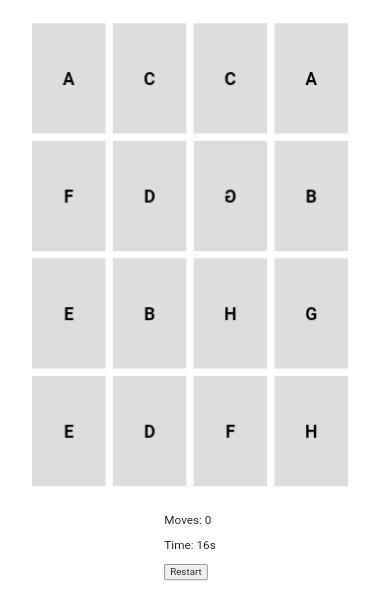

# Memory Matching Game

Welcome to the Memory Matching Game project! This classic memory game allows players to flip over cards to find matching pairs.

## Table of Contents

- [Demo](#demo)
- [Features](#features)
- [Technologies Used](#technologies-used)
- [Getting Started](#getting-started)
- [How to Play](#how-to-play)
- [Customization](#customization)
- [Acknowledgments](#acknowledgments)

## Demo



## Features

1. **Card Grid:**
   - Display a grid of face-down cards.
   - Use HTML and CSS for card layout.

2. **Card Flipping:**
   - Implement JavaScript logic to flip cards when clicked.

3. **Game Logic:**
   - Define an array of card pairs and shuffle them at the start of the game.
   - Track the state of each card (flipped, matched, or hidden).

4. **Matching Mechanism:**
   - Compare the values of flipped cards to determine if they match.
   - If the cards match, keep them face up; otherwise, flip them back.

5. **Game Over:**
   - Display a victory message when all card pairs are matched.

6. **Timer and Moves Counter:**
   - Implement a timer to track how long it takes to complete the game.
   - Keep a count of the number of moves (flips) the player makes.

7. **Restart Button:**
   - Include a button to restart the game.

## Technologies Used

- **HTML:** Structure of the game.
- **CSS:** Styling the game and cards.
- **JavaScript:** Implementing game logic and interactivity.

## Getting Started

To run the game locally, follow these steps:

1. Clone the repository:
   ```bash
   git clone https://github.com/your-username/memory-matching-game.git
   
